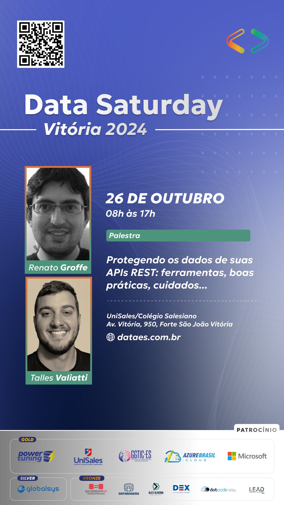
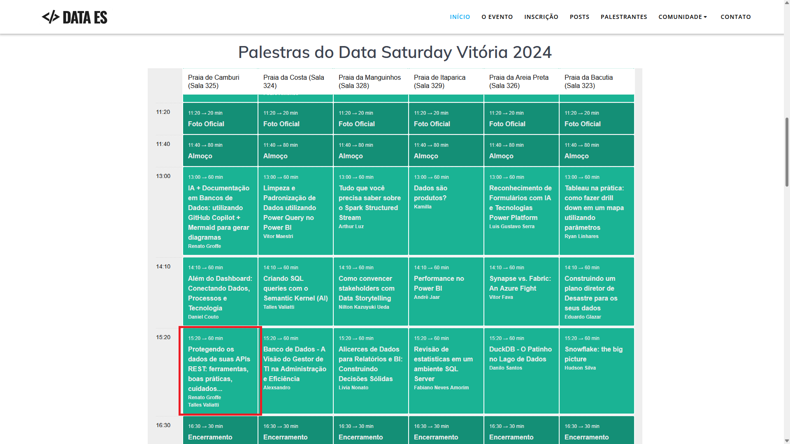
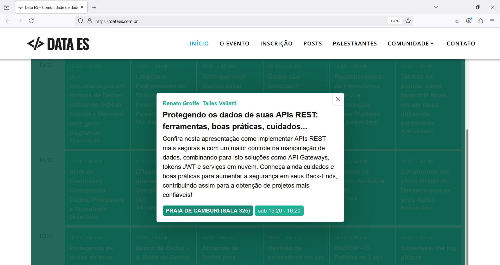
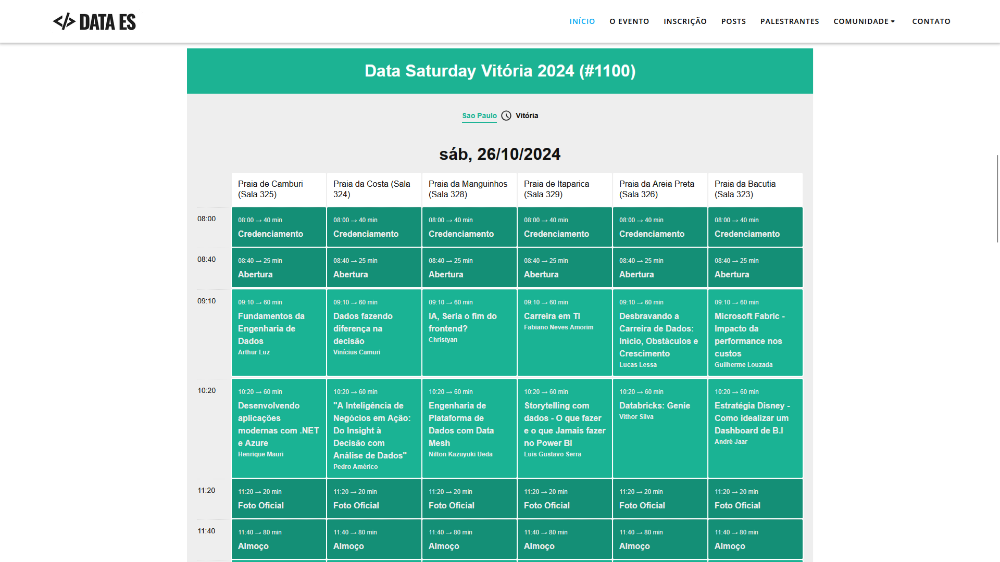

# SegurancaAPIs_DataSaturday-2024-10
Conteúdos sobre Segurança em APIs de apresentação realizada durante a edição 2024 do Data Saturday em Vitória (26/10/2024).

---

Título da apresentação: **Protegendo os dados de suas APIs REST: ferramentas, boas práticas, cuidados...**

Descritivo da apresentação: *Confira nesta apresentação como implementar APIs REST mais seguras e com um maior controle na manipulação de dados, combinando para isto soluções como API Gateways, tokens JWT e serviços em nuvem. Conheça ainda cuidados e boas práticas para aumentar a segurança em seus Back-Ends, contribuindo assim para a obtenção de projetos mais confiáveis!*

Data: **26/10/2024 (sábado)**

Tecnologias e tópicos abordados: **Cybersecurity, JWT, Azure API Management, JWE, Microsoft Entra ID, OWASP API Security Top 10, Rate Limit, .NET, ASP.NET Core...**

Número de participantes: **100 pessoas (estimativa)**

Evento: **Data Saturday Vitória 2024**

Links do evento: **[SQLSaturday](https://sqlsaturday.com/2024-10-26-sqlsaturday1100/)** | **[Data ES - Site](https://dataes.com.br/)** | **[Sessionize](https://sessionize.com/sql-saturday-vitoria-2024/)**

Local: **UniSales - Centro Universitário Salesiano - Avenida Vitória, 950 - Forte São João - Vitória-ES - CEP: 29017-022**

Deixo aqui meus agradecimentos ao **Dirceu Resende**, ao **Talles Valiatti** e demais organizadores por todo o apoio para que eu partipasse como palestrante de mais uma edição do **Data Saturday** em **Vitória**.

---

